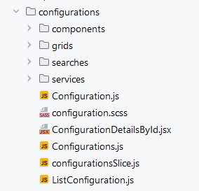

# Host UI

Purpose of this FE container is to consume micro-frontend modules
like PS-ui, Droits-Beneficiaire-ui, Hospi-ui (Factures, Intritables and RocEnLigne), Payement-ui (Paiement and Virement), also in this container is located the CONFIG module (which is of general purpose)  and show in SPA

## Project

### Structure
Host UI unites all rest of modules (**Configurations, PS, Droa Beneftiaire, Payments and Facture**) with single access. 


####  HOST UI Micro-FrontEnd Architecture

Modules bellow are remote Apps wich are distributed trough Webpack Module Federation, they exist in their own independent repos and containers
  * **PS**
  * **Beneftiaire**
  * **Payments**
  * **Facture**

There have more two external remotes which serve common libraries used in every instance like **Host** and rest of **Modules**. 
  * **Lib**
  * **Shared Lib**


###  Configurations module 

Except **Configurations** module all rest of modules as mentioned above **are separated**. But this one, since it affects all the others, is included in this repo for now. Anyway **all modules has identical structure** 
#### Module Structure




We use Dynamic Remotes from Webpack Module Federation to load asynchronous modules and libraries  
https://webpack.js.org/concepts/module-federation/#promise-based-dynamic-remotes

####  Services (REST API) used in HOST UI
For fetching data from backend API we use Redux Toolkit and especially **RTK Query** https://redux-toolkit.js.org/rtk-query/overview 
that give us flexibility and a lot of goodness (like cache management & etc.)
All of this is wrapped with Store and API slices(in remote Shared_Lib_UI). 

Every single module which arrived, become with his API services and just inject his endpoint in Store, like that we have data access with full setup of actions, reducers under the hood of wrapper

> **Note** 
> _Usual used nomenclatures and labels data arrives from Aggregator module (BE API) - URL described in_ **"refs": "${APIURL_REFS}"**,

...


###  Libraries for rendering, state and form management 
are used remote from **Lib_UI** 

> **Note**
> Important thing is that Lib UI contains specific versions of React, React-Dom and Redux arround all modules  


## Getting started

in project directories you can find **[package.json](package.json)** inside are specified all necessary dependencies for project and scripts for **dev** and **prod**

To make it easy for you, here's a list of next steps in terminal.

```
git clone https://git.viamedis.fr/groupe-vdhm/vdhm-platform/common-integration/host-ui.git
cd host-ui
git checkout develop
npm i
npm start
```


###  Configuration
For development needs in **[modules.js](public%2Fmodules.js)** we have specification for all remote allocations of modules and API Services in use

	"remoteApps": {
		"lib_ui": "http://localhost:8038/remoteEntry.js",
		"shared_lib_ui": "http://localhost:8039/remoteEntry.js",
		"ps_ui": "http://localhost:8034/remoteEntry.js",
		...
	},
	"apiUrls": {
		"beneficiaire": "http://XXX.XXX.XXX.XXX:XXXX/api/v1",
		...
	}

Basically in prod we use templates from [public_template](public_template) \ **[modules.js](public_template%2Fmodules.js)** and replace them with values from container variables

They are used from two instances, ones for Webpack build and second one is dynamic in actual app.

Doing so  we have dynamic URLs for API and remoteApps,


    module.exports = {
        "remoteApps": {
            "lib_ui": "${REMOTE_LIB_UI}",
            "shared_lib_ui": "${REMOTE_SHARED_LIB_UI}",
            "hospi_ui": "${REMOTE_HOSPI}",
            "payment_ui": "${REMOTE_PAYEMENTS}",
            "ps_ui": "${REMOTE_PS}",
            "benef_ui": "${REMOTE_BENEF}",
    
        },
        "apiUrls": {
            "beneficiaire": "${APIURL_BENEFICIAIRE}",
            "configurations": "${APIURL_CONFIGURATIONS}",
            "downloadFacture": "${APIURL_DOWNLOAD_FACTURE}",
            "downloadSelAndIdb": "${APIURL_DOWNLOAD_SEL_IDB}",
            "entities": "${APIURL_ENTITIES}",
            "factures": "${APIURL_FACTURES}",
            "fluxFactures": "${APIURL_FLUX_FACTURES}",
            "intraitables": "${APIURL_INTRAITABLES}",
            "paiements": "${APIURL_PAIEMENTS}",
            "ps": "${APIURL_PS}",
            "selAndIdb": "${APIURL_SEL_IDB}",
            "fluxSelAndIdb": "${APIURL_FLUX_SEL_IDB}",
            "virements": "${APIURL_VIREMENTS}",
            "refs": "${APIURL_REFS}",
            "referentiels": "${APIURL_REFERENTIELS}"
        }
    };


>*!!! Like so, we have compilat with variable urls for api, and you can copy dist folder manually at another container and just by changing variable configuration you will have new instance consuming specifisied REST APIs, that can be very handy for versioning for example*

>**Note**
>### You must be sure that used remote modules are alive
>* lib_ui
>* shared_lib_ui
>* hospi_ui (Factures, Intritables and RocEnLigne)
>* payment_ui (Paiement and Virement)
>* ps_ui
>* benef_ui


In file **[webpack.dev.js](webpack.dev.js)** respectively **[webpack.prod.js](webpack.prod.js)** in configuration section of **ModuleFederationPlugin** You can see all shared declaration of used libraries.

            shared: {
                "react": {
                    eager: true,
                    singleton: true,
                    strictVersion: true,
                    requiredVersion: "18.2.0",
                },
                "react-dom": {
                    eager: true,
                    singleton: true,
                    strictVersion: true,
                    requiredVersion: "18.2.0",
                },
                "react-router-dom": {
                    eager: true,
                    singleton: true,
                    version: "5.3.4",
                },
                "redux": {
                    eager: true,
                    singleton: true,
                    version: "4.2.1",
                },
                "react-redux": {
                    eager: true,
                    singleton: true,
                    version: "7.2.9",
                },
                "react-final-form": {
                    eager: true,
                    singleton: true,
                    version: "6.5.9",
                }
            },


## The following technologies are in use:

* Module Federation (Webpack 5)
* React
* Redux
* Redux Toolkit
* React Final form
* MUI 5 (material design)


**Lib UI** which contains  
* React, Redux, Redux Toolkit && React Final form
  * /react, /react-dom, /react-router-dom, /prop-types
  * /redux, /react-redux, /redux-thunk
  * /@reduxjs-toolkit - *(@reduxjs/toolkit/query/react)*, /reduxjs-toolkit - *(@reduxjs/toolkit/)* 
  * /react-final-form, /final-form-arrays
* /react-imask, /react-number-format

and **Shared Lib UI** expose
* /Store - *State management wrapper over* **Redux** 
* /services - *Wrapper for rest API over* **Redux Toolkit**
  * baseApi
  * refsApi
  * referentielApi
* /Theme - Based on **MUI** (MaterialUI 5)
* /assets - *fonts, icons and pictures*
* /Lib - *common components, utils and widgets
  * **Modals** 
    * *confirmations*
      * ConfirmNir
      * ConfirmFactureAnule,
        ConfirmFactureRecyclage,
        ConfirmFactureRejete
    * *messages*
      * MoreThan200Results
      * MoreThan10000ResultsForDownload
      * NoGridResultsAlert
      * NoSearchResultsAlert
  * **Utils**
    * *validators*
      * calcCleFromNir
      * allowSearch,
    * *convertors*
      * dateConvertNaissance, dateConvertNaissanceRAW
      * IntlDateWithHHMM, convertDate, isValidDate
      * currencyFormatter
      * numberFormatter,
    * *statuses ({label, color})* 
      * virementStatus
      * rocStatus
      * paiementsStatus
      * statusesRIB
      * facturesStatus
      * benefStatuses
    * *grid wrapper*
      * MainGrid, SubGrid,
      * ActesGrid, actesGridColumns
  * **Components & commons**
    * usePrevious
    * Drawer, DrawerHeader
    * VirtLink
    * AutoCompleteField
    * PanelNIR
    * AppBar,StyledCard
    * Accordion, AccordionSummary, AccordionDetails
    * TextMaskCustom, MaskedInput,

