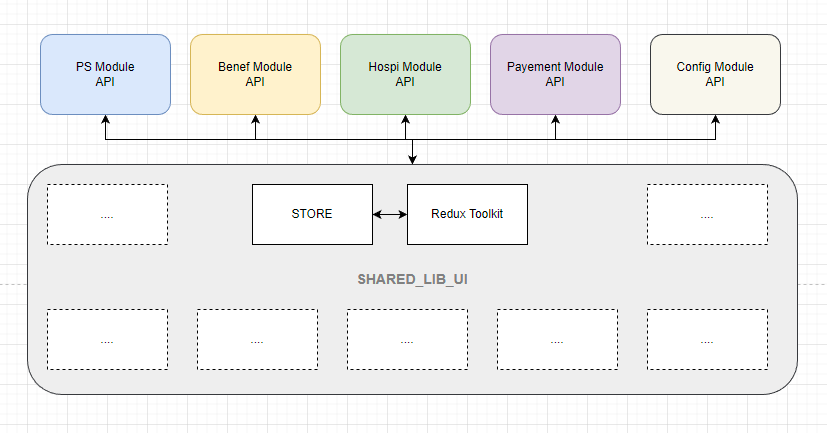
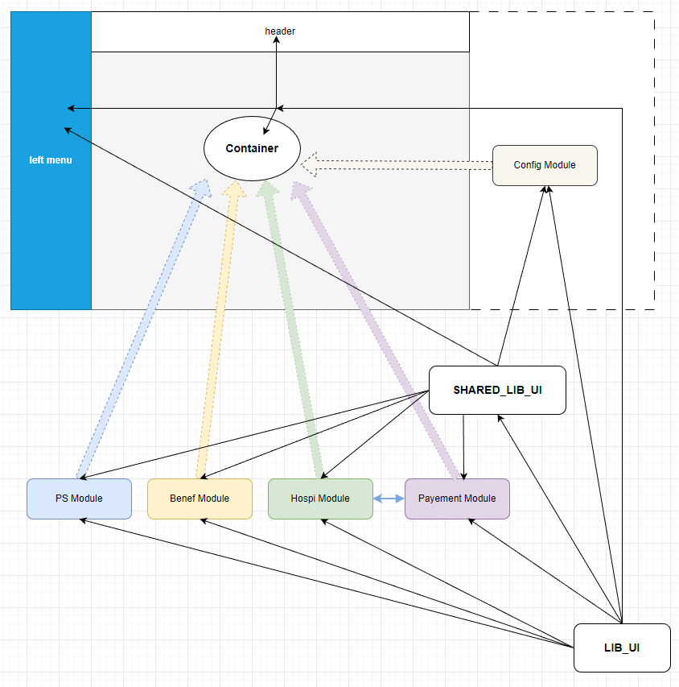

# Host UI

Purpose of this FE container is to consume micro-frontend modules
like PS-ui, Droits-Beneficiaire-ui, Hospi-ui (Factures, Intritables and RocEnLigne), Payement-ui (Paiement and Virement), also in this container is located the CONFIG module (which is of general purpose)  and show in SPA

## Project
Host UI unites all rest of modules with single access, there have two external remotes which serve common libraries like 
**Lib UI** which contains  
* React
* Redux
* Redux Toolkit
* React Final form

and **Shared Lib UI** which contains
* Store
* Services for API
* Theme
* Assets with fonts, icons and pictures
* Lib with common components, widgets and etc.


### Structure

####  REST API used in HOST UI


####  HOST UI

## Getting started

in project directories you can find **[package.json](package.json)** inside are specified all necessary dependencies for project and scripts for **dev** and **prod**

To make it easy for you, here's a list of next steps in terminal.

```
git clone https://git.viamedis.fr/groupe-vdhm/vdhm-platform/common-integration/host-ui.git
cd host-ui
git checkout develop
npm i
npm start
```

 
Also in file **[webpack.dev.js](webpack.dev.js)** respectively **[webpack.prod.js](webpack.prod.js)** in configuration section of **ModuleFederationPlugin** You can see all shared declaration of used libraries.

            shared: {
                "react": {
                    eager: true,
                    singleton: true,
                    strictVersion: true,
                    requiredVersion: "17.0.2",
                },
                "react-dom": {
                    eager: true,
                    singleton: true,
                    strictVersion: true,
                    requiredVersion: "17.0.2",
                },
                "react-router-dom": {
                    eager: true,
                    singleton: true,
                    version: "5.3.4",
                },
                "redux": {
                    eager: true,
                    singleton: true,
                    version: "4.2.1",
                },
                "react-redux": {
                    eager: true,
                    singleton: true,
                    version: "7.2.9",
                },
                "react-final-form": {
                    eager: true,
                    singleton: true,
                    version: "6.5.9",
                }
            },

For development needs in **[modules.js](public%2Fmodules.js)** we have specification for all hosting allocations of remote API Services in use

	"remoteApps": {
		"lib_ui": "http://localhost:8038/remoteEntry.js",
		"shared_lib_ui": "http://localhost:8039/remoteEntry.js",
		"ps_ui": "http://localhost:8034/remoteEntry.js",
		...
	},
	"apiUrls": {
		"beneficiaire": "http://XXX.XXX.XXX.XXX:XXXX/api/v1",
		...
	}

Basically in prod we use templates in **[modules.js](public_template%2Fmodules.js)** and replace them with container variables 

    module.exports = {
        "remoteApps": {
            "lib_ui": "${REMOTE_LIB_UI}",
            "shared_lib_ui": "${REMOTE_SHARED_LIB_UI}",
            "hospi_ui": "${REMOTE_HOSPI}",
            "payment_ui": "${REMOTE_PAYEMENTS}",
            "ps_ui": "${REMOTE_PS}",
            "benef_ui": "${REMOTE_BENEF}",
    
        },
        "apiUrls": {
            "beneficiaire": "${APIURL_BENEFICIAIRE}",
            "configurations": "${APIURL_CONFIGURATIONS}",
            "downloadFacture": "${APIURL_DOWNLOAD_FACTURE}",
            "downloadSelAndIdb": "${APIURL_DOWNLOAD_SEL_IDB}",
            "entities": "${APIURL_ENTITIES}",
            "factures": "${APIURL_FACTURES}",
            "fluxFactures": "${APIURL_FLUX_FACTURES}",
            "intraitables": "${APIURL_INTRAITABLES}",
            "paiements": "${APIURL_PAIEMENTS}",
            "ps": "${APIURL_PS}",
            "selAndIdb": "${APIURL_SEL_IDB}",
            "fluxSelAndIdb": "${APIURL_FLUX_SEL_IDB}",
            "virements": "${APIURL_VIREMENTS}",
            "refs": "${APIURL_REFS}",
            "referentiels": "${APIURL_REFERENTIELS}"
        }
    };


they are used from two instances, one for building app from webpack
and another one is actual app. Like that we have dynamic URLs for API and remoteApps,

>*!!! you can copy dist folder manually at another container and just by changing variable configuration you will have new instance consuming specifisied REST APIs, that can be very useful for versioning for example*


## The following technologies are in use:

* Module Federation (Webpack 5)
* React
* Redux
* Redux Toolkit
* React Final form
* MUI 5 (material design)

>### You have to be sure that used remote modules are alive and served* lib_ui
>* shared_lib_ui
>* hospi_ui (Factures, Intritables and RocEnLigne)
>* payment_ui (Paiement and Virement)
>* ps_ui
>* benef_ui


